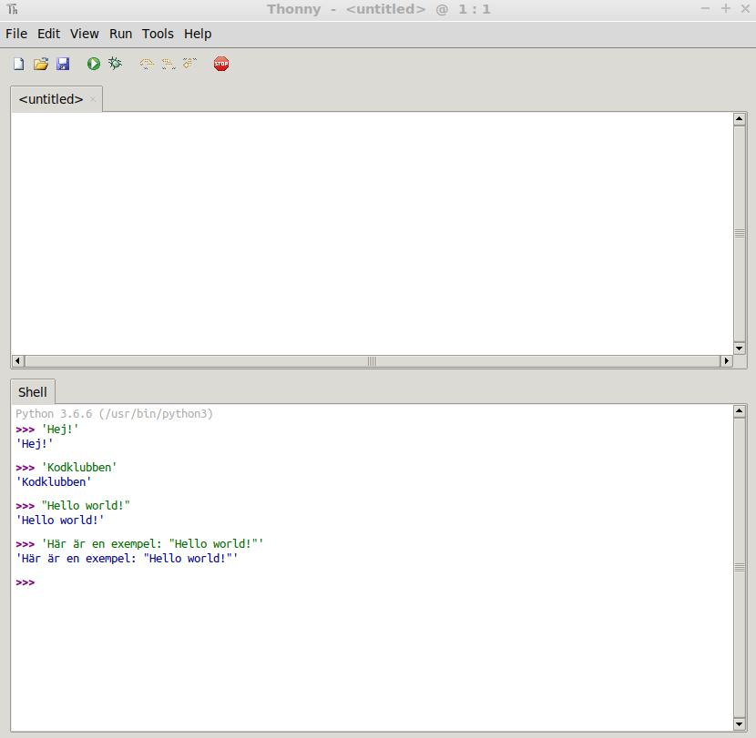
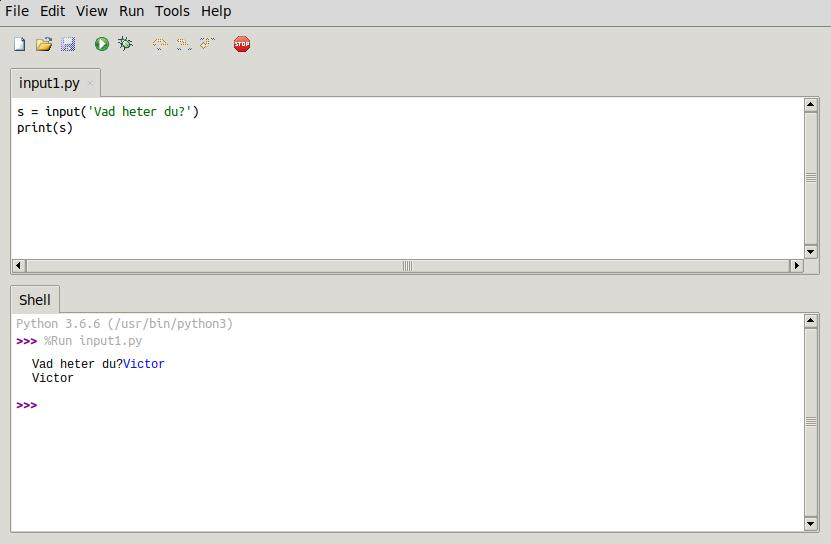
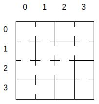
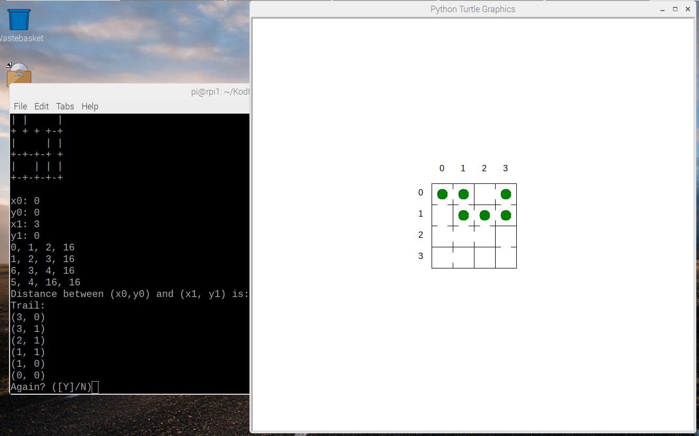
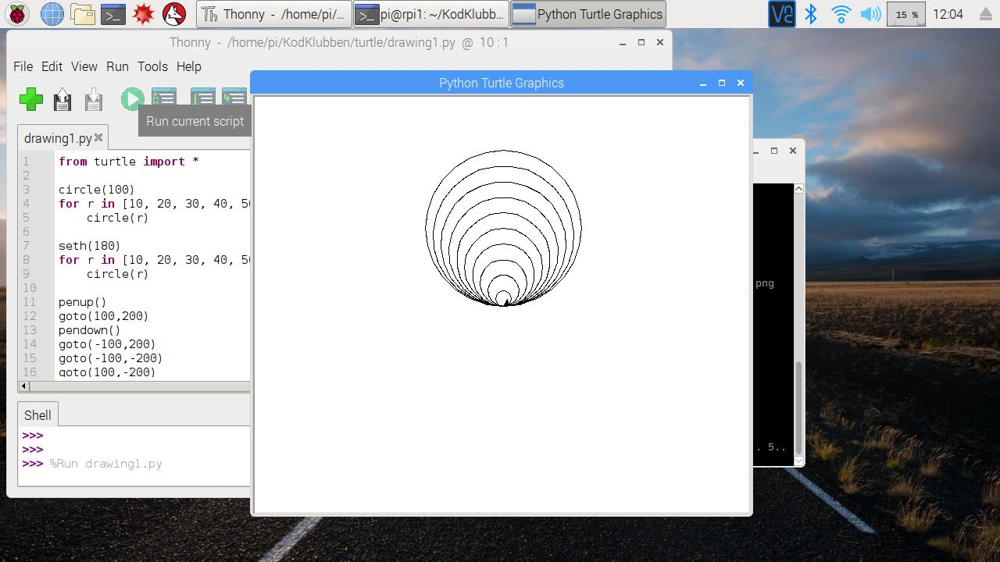
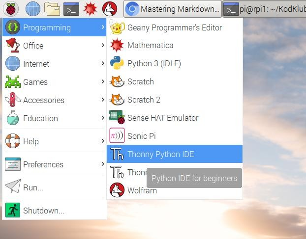
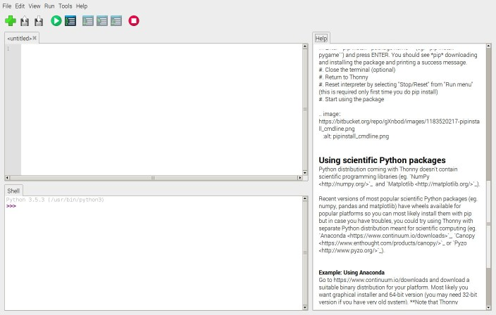

# KodKlubben

See [[Code Club]](https://kodklubben.readthedocs.io/sv/latest/).

På [[Kodklubben
Dokumentation]](https://kodklubben.readthedocs.io/sv/latest/) finns
mera information.

# 21.11.2018: Bygga i Minecraft med text

## Ladda ner filer

Lada ner den här filerna i Downloads mappen:

  1. [[minecraft/mcblocks.py]](https://raw.githubusercontent.com/vbos70/KodKlubben/master/minecraft/mcblocks.py)
  1. [[minecraft/mcbuild.py]](https://raw.githubusercontent.com/vbos70/KodKlubben/master/minecraft/mcbuild.py)
  1. [[minecraft/house.mcb]](https://raw.githubusercontent.com/vbos70/KodKlubben/master/minecraft/house.mcb)


## Starta Minecraft

Starta Minecraft och börja en spel.

## Kor `mcbuild.py` i en terminal

```
$ cd Downloads
$ python3 mcbuild.py house.mcb

```

## Redigera `house.mbc`

Öppna `house.mbc` i Thonny IDE och ändra husets ritning:

1. Använt andra block
1. Ändra husets storlek
1. Ändra rumindelning
1. ...

Obs. Efter varje ändring ska du spara filen och köra mcbuild.py igen.

# 14.11.2018: Minecraft


## Ladda ner filer

  1. [[minecraft/minecraft_bunker.py]](https://raw.githubusercontent.com/vbos70/KodKlubben/master/minecraft/minecraft_bunker.py)
  1. [[minecraft_house.py]](https://raw.githubusercontent.com/vbos70/KodKlubben/master/minecraft/minecraft_house.py)


Spara filerna i Downloads mappen.

## Starta minecraft (new game)


## I en terminal, kör

```
cd Downloads
```

## Bygga en hus:
```
python3 minecraft_house.py
```

## Bygga en bunker:

```
python3 -i minecraft_bunker.py
>>> clear_bunker_grid(4)
>>> build_bunker_in_grid(1,1)
>>> build_bunker_in_grid(3,2)
>>> build_bunker_in_grid(0,0)
```


# 7.11.2018: Mera labyrinter

## Ladda ner och pröva `maze3.py`

1. Right-click på `maze3.py` och välja 'Save link as' (spara link som).

  [[maze/maze.3py]](https://raw.githubusercontent.com/vbos70/KodKlubben/master/maze/maze3.py)

   Spara filen i `Downloads` mappen.
   
1. Öppna en terminal och ge följande kommandot för att köra programmet:

```
cd Downloads
python3 maze3.py
```

1. Testa programmet med olika inputs.

## Öppna programmet i Thonny Python IDE

1. Öppna Thonny Python IDE

1. Välja `File` - `Open` från menyn och letar fram `maze3.py` i mappen
  `Downloads`

## Rutor i en labyrint

En labyrint av storlek 4 har 4x4 'cells' (rutor). En ruta är 2 nummer:
(x,y). Till exempel (0,0), (1,0), (0,1), och (3,3).

Den första nummer kallas *x-koordinaten* och den andra
*y-koordinaten*. X-koordinaten ger rutans plats (i labyrinten) från
vänster till höger. Y-koordinaten ger rutans plats från toppen till
botten.

Koordinater börjar med 0 och är maximalt 1 mindre än labyrintens
storlek. Dvs, i en labyrint med storlek 4 finns koordinater 0, 1, 2
och 3.

1. Leta fram den Python funktioner (functions) som ger
x-koordinaten och y-koordinaten för en cell. Vad heter dessa functioner?

## Färger

Leta fram funktionen `draw_maze` som ritar labyrinten. Här kan du
ändra färgerna på labyrinten:

```
   color = {
      'background' : 'LightGrey',
      'walls' : 'DarkBlue',
   }
   
```

`'background'` (bakgrund) är färgen för labyrintens
bakgrund. `'walls'` är färgen på labyrintens väggar. I koden är
bakgrunden definierat som `'LightGrey'` och väggarna som `'DarkBlue'`.

I filen `/usr/share/X11/rgb.txt` på Raspberry Pi hittar du namn på
många färgen. Öppna den fil i Thonny.

1. Ändra färg på labyrintens bakgrund och väggarna.

## Storlek av rutor

När du ritar en labyrint med storlek 30 eller mera, passar denn inte i
fönstret. Men om det är ok med små rutor, så kan vi rita lite större
labyrinter.

Leta fram funktionen `image_scale` i `maze3.py`:

```
def image_scale():
   return 30
```

Den här funktionen definierar att 1 koordinat kommer överens med 30
pixlar på skärmen. Alltså, 1 ruta blir ritat som en kvadrat / fyrkant
med varje sida 30 pixlar lång.

För att ändra storleken av en ruta (och labyrinten), ändrar du nummret
`30`. Tar  du `20`, så  blir labyrinten mindre.  Tar du `40`,  så blir
labyrinten större.


# 31.10.2018: Text input/output

Många program frågar användaren att mata in text *input* och sen
genererar programmet text *output*.  Programmet
[[maze/maze.py]](https://raw.githubusercontent.com/vbos70/KodKlubben/master/maze/maze.py),
som vi körde förra gång, frågar användaren att mata in labyrintens
storlek som text och sen ritar den en labyrint och skriver något text.

Hur skriver man kod som läser in text input och genererar text output?

## Strings

I en dator er text rader av symboler. Denna rader kallas
*strings*. För att skriva kod för strings, måste man skilja program
kod text från string text. I Python använder man `'` och `"` för att
inkludera strings i kod. Här är några exempel av strings i Python:

- `'Hej!'`
- `'KodKlubben'`
- `"Hello world!"`
- `'Här är en exempel: "Hello world!"'`

Obs. i varje exempel är den första och sista `'` eller `"` inte del av
den string. Symbolerna `'` och `"` bara används för att starta och
avsluta en string. Dvs., string `'Hej!'` har 4 symboler: `H`, `e`, `j`,
och `!`. En string ska börjas och avslutas med samma symbol. Om man
vill ha en string med en `'` symbol kan man ta `"` som start och
avslutning. Sista exempel har `'` som start och avslutningssymbol och
innehåller 2 `"` symboler.

### Pröva i Thonny IDE

Öppna Thonny IDE och skriva några strings i *Shell* fönstret:



## Input och output i Python

Öppna en ny fil i Thonny och skriv följande programmet:

```
s = input('Vad heter du?')
print(s)
```

Det här programmet kör Pythons `input` 'function'. `input` läser in
från tangentbordet tills *Enter* och ger tillbaka den inlästa string.

När du kör programmet i Thonny ser det ut som här:


1. Hur kan du ändra programmet för att få mellanslag mellan frågan
   'Vad heter du?' och svaret?
   
2. Strings kan klistras ihop med *plus*: `'första' + ' andra'` blir
   `'första andra'`.  Kan du ändra programmet så att den skriver först
   *Hej* och sen svaret på frågan *Vad heter du?*:
   
```
Vad heter du? Victor
Hej Victor
```

3. För att skriva varenda symbol i an string på en rad, kan man
skriva en 'for loop' (Pröva i Thonny): 

``` 
s = input('Vad heter du? ')
for c in s: 
    print(c) 
``` 

Obs. akta 'indentation' på början av `print`-raden (dvs. 4 mellanslag).


4. Med en 'for loop' kan man också räkna ut längden av en string:

```
s = input('Vad heter du? ')
l = 0
for c in s:
    l = l + 1
print('Ditt namn har', l, 'bokstäver.')
```

5. Man kan också läsa in ett nummer:

```
n = input('Nummer: ')
print(n)
```

Men vet programmet faktiskt att det är ett nummer?

6. Försök läsa in och addera 2 nummer:

```
n1 = input('Nummer 1: ')
n2 = input('Nummer 2: ')

print(n1 + n2)
```
   Kör programmet i Thonny. Vad händer?
   
   Programmet har klistrat ihop 2 strings!
   
7. Som sagt, `input` ger bara strings. Om du vill läsa in ett nummer,
   börjar du med att läsa in en string och sen omvandlas du den i ett
   nummer med `int`:
```
nstr = input('Nummer: ')
n = int(nstr)
print(n)
```
   Obs. om du kör det här programmet, ska du ge bara siffror som input.

   Kan du ändra programmet i uppgift 6 så att den adderar 2 nummer
   istället för att klistra ihop 2 strings?

8. Innan du använder `int` ska du vara säker på att det finns bara
   siffror i den string som du vill konvertera i ett nummer. `int`
   kraschar om det finns icke siffror i stringen:
```
>>> int('12ab')
Traceback (most recent call last):
  File "<pyshell>", line 1, in <module>
ValueError: invalid literal for int() with base 10: '12ab'
```

Pröva `int` i Thonnys 'Shell' fönstret och kolla vad händer med olika
'inputs'.

9. Du kan använda en `for loop` för att kolla om det finns bara
   nummer i stringen innan du omvandlar den i ett nummer:
   
```
nstr = input('Nummer: ')
for c in nstr:
    if c not in ['0','1','2','3','4','5','6','7','8','9']:
        print('Det finns icke-siffror i', nstr)
	exit()
print('Numret är:', int(nstr))
```

Kör programmet med olika input.

Obs. Programmet använder `exit` 'function' för att avsluta när en
icke-siffra har hittats.

10. En program som omvandlar många nummer, ska ha en namn for den
    omvandlingskod I Python skriver man en 'function' for att ge en
    namn till kod:
	
```
def string_to_int(s):
    for c in s:
	    if c not in ['0','1','2','3','4','5','6','7','8','9']:
		    print('Det finns icke-siffror i', s)
		    return 0
	return int(s)
nstr = input('Nummer: ')
print('Numret är:', string_to_int(nstr))
```

Kör programmet med olika input.


## Mera labyrint program

Här är labyrint program:

1. [[maze/maze.py]](https://raw.githubusercontent.com/vbos70/KodKlubben/master/maze/maze.py): har 3 'bugs' som vi försökte fixa
   förra gången.
   
1. [[maze/fixed_maze.py]](https://raw.githubusercontent.com/vbos70/KodKlubben/master/maze/fixed_maze.py): har fixat den 3 bugs men kan
   krascha på några inputs.

1. [[maze/maze2.py]](https://raw.githubusercontent.com/vbos70/KodKlubben/master/maze/maze2.py): har lite mindre bugs.

1. [[maze/maze3.py]](https://raw.githubusercontent.com/vbos70/KodKlubben/master/maze/maze3.py): har lite mindre bugs och mera output.

Ladda ner och köra dessa maze program. Försök att krascha dom.


# 24.10.2018: Labyrint


Labyrinten har rutor. Mellan rutorna finns väggar. Några väggar har
dörrar som man kan gå genom. Här är en labyrint:



Hur hittar man kortaste vägen mellan 2 rutor i labyrinten?

Vi letar efter en väg som har det minsta antalet dörrar. Det är
möjligt att det finns flera av dessa kortaste vägar. Det är också
möjligt att det inte finns en väg alls.

## Kortaste väg - algoritm

En *algoritm* kan man utföra för att komma från en startpunkt till ett
svar. En algoritm är som en recept som man följer steg för steg. För
att kallas en algoritm, ska stegen vara så exakta att svaret är samma
oberoende av vem eller vad som kör algoritmen. Om man börjar från
samma startpunkt och följer stegen, så ger algoritmen alltid samma
svar.

Här är en algoritm som hittar kortaste vägen i en labyrint:

1. Först väljer man en ruta som är start och en ruta som är slut.

1. Skriv numret 0 i startrutan.

1. Hitta alla rutor som inte har något nummer än men som har en dörr till
   en ruta som redan har ett nummer och gör såhär:
   
   - om en grannruta med dörr har numret x, räkna ut vad x+1 är och
     skriv svaret i alla hittade rutor som inte har ett nummer än.
	 
	 Till exempel, om grannrutan har numret 0, så skriver du numret 1
     i alla hittade rutor utan nummer.

   Obs. det är viktig att hitta alla grannrutor med dörr innan du
   fortsätter!
   
1. Gör föregående steg igen tills alla rutor som man hittar har ett
   nummer.

1. Kolla om slutrutan har ett nummer

   - om den har ett nummer, så är numret det minsta antal dörrar på
     vägen från start till slut.
   
   - om den inte har ett nummer, så finns det ingen väg från start till
     slut.


## Kod for kortaste väg algoritm

Algoritmen är kodat i filen [[maze/maze.py]](maze/maze.py).

1. Ladda ner filen [[maze/maze.py]](maze/maze.py) och
   öppna med Thonny IDE.

1. Kör programmet några gånger och pröva olika labyrinter.

1. Fixa "function" `draw_trail` och function `__main__` och kör
   programmet igen.

1. Om du fixade programmet rätt, så visas den en ruta genom labyrinten.


Det finns också en fil [[maze/fixed_maze.py]](maze/fixed_maze.py). I
den filen är alla 'bugs' redan fixat. Ladda ner och kör
[[maze/fixed_maze.py]](maze/fixed_maze.py) och kolla att den visar
vägen genom labyrinten:




# 17.10.2018: höstlov

Ingen KodKlubben

# 10.10.2018 och 3.10.2018: Programmera Minecraft, spela Minecraft


1. Starta Minecraft och skapa en ny värld.

1. Lämna Minecraft fönstret i bakgrunden (`TAB`) och öppna Thonny Python IDE.

1. Koda i Python, se exempel.

1. Kör din kod och kolla vad händer i Minecraft fönstret.


## Här ar några exempel:

Kopiera den här exempel i Thonny Python IDE, spara filen (varje
exempel i en ny fil), och kör din kod.


### Posta till Minecraft chatten:


```
from mcpi import minecraft, block
 
mc = minecraft.Minecraft.create()
msg = "Hej! Jag kodar Minecraft."
mc.postToChat(msg)
```

###  Hoppa i lyften

```
from mcpi import minecraft, block
import time
 
def jump(distance):
    #Let's wait 1 second
    time.sleep(1)
    
    #Retrieve the X,Y,Z coordinates of the player
    pos=mc.player.getPos()
    #Change the Y coordinate of the player to position it up in the sky    
    mc.player.setPos(pos.x, pos.y + distance, pos.z)

# Connect to Minecraft 
mc = minecraft.Minecraft.create()

 
#Main Program Starts Here:
jump(100)
```

### Bygga med block

```
from mcpi import minecraft, block
import time
 
def createTower():
    #Let's wait 1 second
    time.sleep(1)
    
    #Retrieve the X,Y,Z coordinates of the player
    pos=mc.player.getPos()
 
    #Create a 10-block high tower, 5 blocks away from the player
    mc.setBlock(pos.x + 5, pos.y, pos.z, block.STONE)
    mc.setBlock(pos.x + 5, pos.y+1, pos.z, block.STONE)
    mc.setBlock(pos.x + 5, pos.y+2, pos.z, block.STONE)
    mc.setBlock(pos.x + 5, pos.y+3, pos.z, block.STONE)
    mc.setBlock(pos.x + 5, pos.y+4, pos.z, block.STONE)
    mc.setBlock(pos.x + 5, pos.y+5, pos.z, block.STONE)
    mc.setBlock(pos.x + 5, pos.y+6, pos.z, block.STONE)
    mc.setBlock(pos.x + 5, pos.y+7, pos.z, block.STONE)
    mc.setBlock(pos.x + 5, pos.y+8, pos.z, block.STONE)
    mc.setBlock(pos.x + 5, pos.y+9, pos.z, block.STONE)
    mc.setBlock(pos.x + 5, pos.y+10, pos.z, block.STONE)
 
# Connect to Minecraft 
mc = minecraft.Minecraft.create()

#Main Program Starts Here:
createTower()
```

### Bygga en Pyramid

```
from mcpi.minecraft import Minecraft
from mcpi import block

# Connect to Minecraft
mc = Minecraft.create()

# Determine the Player's current position.
x,y,z = mc.player.getTilePos()


PYRAMID_SIZE = 5
PYRAMID_BLOCK1 = block.STONE
PYRAMID_BLOCK2 = block.GLOWSTONE_BLOCK
OFFSET = 5

# Create empy space to build the pyramid
mc.setBlocks(x-PYRAMID_SIZE-2, y, z+OFFSET,
             x+PYRAMID_SIZE+2, y+PYRAMID_SIZE+2, + z+2*PYRAMID_SIZE+2,
             block.AIR.id)


d = 0
s = PYRAMID_BLOCK1

for layer in range(PYRAMID_SIZE):
    mc.setBlocks(x-PYRAMID_SIZE+d, y+layer, z+OFFSET+d,
                 x+PYRAMID_SIZE-d, y+layer, z+OFFSET+(2*PYRAMID_SIZE - d),
                 s.id)
    d += 1
    if s == PYRAMID_BLOCK1:
        s = PYRAMID_BLOCK2
    else:
        s = PYRAMID_BLOCK1

mc.player.setPos(x, PYRAMID_SIZE+1, PYRAMID_SIZE+OFFSET)

```

## Links till Minecraft sidor


[[Minecraft control keys]](https://arghbox.files.wordpress.com/2013/07/minecraft-pi-controls.png): Hur du använder tangentbordet och mus i Minecraft.

[[Minecraft Python Challenges]](https://www.101computing.net/minecraft-python-challenges/): Enkla exempel som visar hur du programmerar Minecraft.


[[Minecraft API]](https://www.stuffaboutcode.com/p/minecraft-api-reference.html): Mycket om Minecraft Python API.


[[MagPi Minecraft Maker Guide]](https://www.raspberrypi.org/magpi-issues/MagPi58.pdf): Tidning om Raspberry Pi och Minecraft.

[[mcpipy]](https://github.com/brooksc/mcpipy): GitHub sidan med Python code för att programmera Minecraft.

# 26-09-2018: Turtle Graphics

Den här gången fortsätta vi med Python kod, men nu ska vi rita.

### Innan vi börjar

1. Tömma `Downloads` mappen

1. Ladda ner .zip filen från https://github.com/vbos70/KodKlubben

1. Extrahera .zip filen i `Downloads` mappen


### Starta Thonny IDE

1. Öppna filen

   `Downloads/KodKlubben-master/turtle/drawing1.py`

1. Kör (klicka gröna pil knappen)




### Kan du ändra koden så att ...

1. den ritar flera cirklar?

1. den ritar röda cirklar?


### Mera turtle "commands"

Här ar flera turtle "commands". Testa vad dom gör i din kod.

- `forward(10)`
- `backward(10)`
- `left(90)`
- `right(90)`
- `stamp()`
- `speed(1)`
- `speed(10)`

Och det finns ännu flera commands på
[Python Turtle Graphics](https://docs.python.org/3/library/turtle.html)

# 19.09.2018: Python och Thonny

### Starta Thonny IDE

Leta fram och klicka Thonny IDE på meny.



När Thonny har startas up, ser du en fönster som den här:



#### Edit fönstret i Thonny

Edit fönstret är just under knapparna. Här skriver man Python kod /
program som du kan spara i filer. Filnamnet visas ovanpå fönstret. 
Här på bilden heter den `<untitled>` (namnlös).

#### "Shell" fönstret i Thonny
 
Längst ner finns "Shell" fönstret som visar "Python":

```
Python 3.5.3 (/usr/bin/python3)
```

Här skriver man enskilda Python meningar som Python beräknar efter
du klicka `Enter`. Till exempel:

```
>>> 1+3
4

```

Här finns flera Python "expressions" (meningar) som du kan försöka

  - `10 + 2 * 3`
  - `(10 + 2) * 3`
  - `1.5 - 0.32`
  
Python kan också räkna med "strings" (listor av bokstäver):

  - `"Hej, vad heter du"`
  - `'Hej, vad heter du' + "?"` 
  - `"Här kodar Ingås kodklubb!"`
  - `"Hej!" * 10` 

Strings börjar och slutar med `"` eller `'`.
  


# 12.9.2018:  Vi börjar

Första gången ska vi

1. Bekanta oss med Raspberry Pi:
   1. Öppna "boxen"
   1. Ansluta allt
   1. Starta upp
   1. Stänga av
   1. Sätt in SD kortet
   1. Starta upp igen

   Se även
   https://projects.raspberrypi.org/en/projects/raspberry-pi-getting-started

1. Upptäcka vad Raspberry Pi kan

   Starta upp program som är redan installerat

1. Konfigurera wifi och Internetanslutning

   * wifi password

   * starta och testa webbrowsern 'chromium'

1. Spela 

1. Koda

   1. I chromiums startsida (search engine), sök: vbos70 KodKlubben

   1. Ladda ner '.zip' fil

      Klicka "Clone or download" och välja "Download zip"

   1. Extrahera filen

   1. Öppna Python kod i Thonny Python IDE

   1. Köra Python kod


