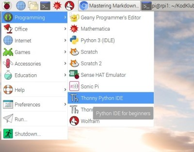

# KodKlubben

Kod för Ingås kodare

## Vi börjar

Första gången ska vi

1. Bekanta oss med Raspberry Pi:
   1. Öppna "boxen"
   1. Ansluta allt
   1. Starta upp
   1. Stänga av
   1. Sätt in SD kortet
   1. Starta upp igen

   Se även
   https://projects.raspberrypi.org/en/projects/raspberry-pi-getting-started

1. Upptäcka vad Raspberry Pi kan

   Starta upp program som är redan installerat

1. Konfigurera wifi och Internetanslutning

   * wifi password

   * starta och testa webbrowsern 'chromium'

1. Spela 

1. Koda

   1. I chromiums startsida (search engine), sök: vbos70 KodKlubben

   1. Ladda ner '.zip' fil

      Klicka "Clone or download" och välja "Download zip"

   1. Extrahera filen

   1. Öppna Python kod i Thonny Python IDE

   1. Köra Python kod


## Andra gången: Python och Thonny

### Starta Thonny IDE

Leta fram och klicka Thonny IDE på meny.



När Thonny har startas up, ser du en fönster som den här:


#### Edit fönstret i Thonny

Edit fönstret är just under knapparna. Här skrivar man Python kod /
program som du kan spara i filer. Filnamnet visas övanpå fönstret. 
Här på bilden heter denn `<untitled>` (namnlös).

#### "Shell" fönstret i Thonny
 
Längst ner finns "Shell" fönstret som visar "Python":

```
Python 3.5.3 (/usr/bin/python3)
```

Här skriver man enskilda Python meningar som Python beräknar efter
du klicka `Enter`. Till exempel:

```
>>> 1+3
4

```

Här finns flera Python "expressions" (meningar) som du kan försoka:

  - `10 + 2 * 3`
  - `(10 + 2) * 3`
  - `1.5 - 0.32`
  
Python kan också räkna med "strings" (listor av bokstävar):

  - `"Hej, vad heter du"`
  - `'Hej, vad heter du' + "?"` 
  - `"Här kodar Ingås kodklubb!"`
  - `"Hej!" * 10` 

Strings börjar och slutar med `"` eller `'`.
  
##  26-09-2018: Turtle Graphics

Den här gången fortsätta vi med Python kod, men nu ska vi rita.

### Inan vi börjar

1. Tömma `Downloads` mappen

1. Ladda ner .zip filen från https://github.com/vbos70/KodKlubben

1. Extrahera .zip filen i `Downloads` mappen


### Starta Thonny IDE

1. Öppna filen

   `Downloads/KodKlubben-master/turtle/drawing1.py`

1. Kör (klicka gröna pil knappen)


### Kan du ändra koden så att ...

1. den ritar flera cirkel?

1. den ritar röda cirkel?


### Mera turtle "commands"

Här ar flera turtle "commands". Testa vad dom gör i din kod.

- `forward(10)`
- `backward(10)`
- `left(90)`
- `right(90)`
- `stamp()`
- `speed(1)`
- `speed(10)`

Och det finns änu flera commands på https://docs.python.org/3/library/turtle.html


