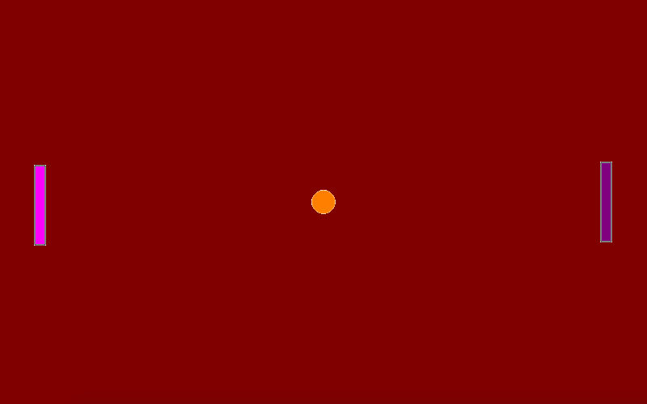
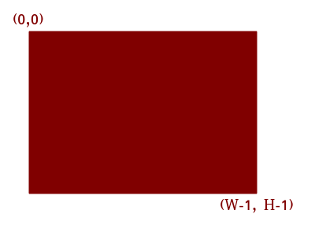

Pong
====

Spelet *Pong*'s kod finns i mappen *./pgzero/pong* i Kodklubbens
repository (för att ladda ner eller klona den, ser `Kodklubben
GitHub`_).

.. _Kodklubben GitHub: https://github.com/vbos70/KodKlubben/

Spelet startas i terminalen med kommandot::

  $ pgzrun pong.py

Obs: kommandot funkar om du är i mappen 'pgzero/pong' (man kommer dit
med kommandot ``cd pgzero/pong``).

Vår *Pong* spel ser ut som här:

Efter 3 sekunder börjar bollen röra sig mot vänster spelaren. Vänster
spelaren kann flyttas upp med ``w``-knappen och ner med ``z``-knappen.

När bollens vänstra sidan rör (vänstra) spelarens högra sidan, blir
bollen slagen tillbaka till högra spelaren.

Om du väntar tills bollen kommer nära den högra spelaren, märker du
att högra spelaren kann inte röra sig och att bollen går rakt igenom
den! Det är inte bra. Programmet *pong.py* har fel ('bugs').  Kan du
fixa denna ´bugs'?

Koordinater
-----------

*Pong* är en 2-dimensional spel. Vi har alltså horisontala koordinater
och vertikala koordinater. Horisontala koordinater kallas också för
*X-koordinater* och vertikala koordinater kallas för
*Y-koordinater*. En punkt på skärmen har en X-koordinat och en
Y-koordinat. Vi skriver punktens koordinater som *(X, Y)*.

På en dator skärm börjar X och Y-koordinater vanligtvis i vänstra topp
hörnan. Dvs, punkten med koordinater (0,0) är skärmens vänstra topp
hörnan.

När man gär till höger blir X-koordinaten större. När man går ner blir
Y-koordinaten större. Därfor har skärmens högra botten hörnan
största koordinaterna.
 
Om skärmens storlek är 800x600 *pixlar*, har den 800 horisontala
pixlar och 600 vertikala pixlar. Koordinater börjar räknas
från 0. Därför, en skärm med storlek 800x600 har X-koordinater från
0..799 och Y-koordinater från 0..599. Obs., X-koordinaten 800 finns
inte på skärmen och Y-koordinaten 600 inte heller. Skärmens högra
botten hörna har koordinater (799, 599).

Nästa bild visar det här koordinat systemet för en skärm med storlek
*WxH*. Du ser (och förstår?!) att högra botten hörna har koordinater
(W-1, H-1) och inte (W, H).

	   

Röra högra spelaren
-------------------

1. Öppna *pong.py* i din textredigerara ('text editor'), t.ex *Thonny
   IDE* eller *Idle*.

2. Letar efter den här kodlinjer i *pong.py*::
     
        # Player1
        if keyboard.w:
            # 'w' means UP
            player1.speed_y = -SPEED
        elif keyboard.z:
            # 'z' means DOWN
            player1.speed_y = SPEED
        else:
            # otherwise no movement
            player1.speed_y = 0

	# Player2
        if keyboard.i:
            # 'i' means UP
            # remove 'pass' and write the code here
            pass
        elif keyboard.m:
            # 'm' means DOWN
            # remove 'pass' and write the code here
            pass
        else:
            # otherwise no movement
            player2.speed_y = 0

3. Läs kodlinjerna. Det finns instruktioner var du ska ändra dom och
   genom att kålla linjerna for vänstra spelaren (``player1``) kan du
   skriva kodlinjer som får högra spelaren att röra sig upp med
   ``i``-knappen och ner med ``m`` knappen.

   Kodlinjerna som ska ändras har nu ordet ``pass``.

