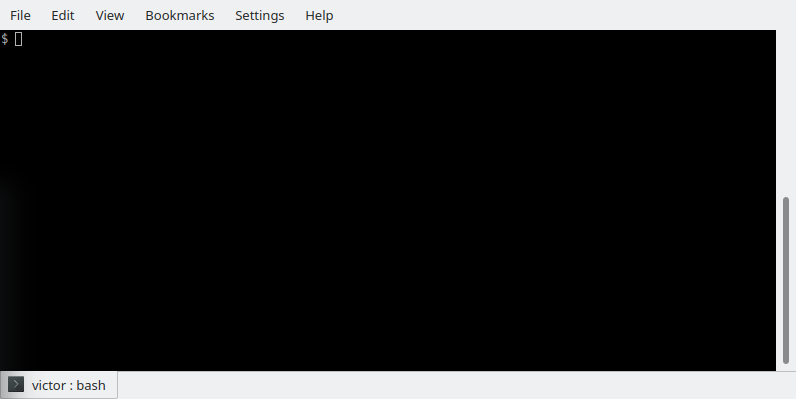

Terminal, shell, och kommandon
==============================

Terminal
--------

Terminalen är en fönster som kör en 'shell' och 'shell'-et läser in
kommandon du skriver och (om du har skrivit rätt) utför den. Det finns
många olika terminalen och dom kan ser olika ut. Terminalen jag
använder heter *Konsole* och ser ut som här:

Den här terminalen visar ``victor : bash`` under det stora
textfälltet. Det betyder att terminalens 'shell' heter 'bash' och
användarens 'user name' är victor.

Du ger/skrivar kommandon i textfälltet och 'shell'-et ger kommandons
resultat och andra meddelanden också i textfälltet. 

Shell
-----

På svenska kallar man 'shell' för kommandospråkstolkare (se t.ex.,
https://sv.wikibooks.org/wiki/Lathund_f%C3%B6r_terminalkommandon_i_linux/bash_scriptning). Det
är för långt så jag använder 'shell' på engelska.

'Shell'-et har en prompt och en markör som anger var du skrivar dit
nästa kommandot. Vanligtvis är prompten symbolen ``$`` och markören en
fylld rektangel (på bilden övanpå är markören ihålig, men det beror på
att terminalens fönster var inaktiverat när bilden togs).

'Shell'-et vet vad din *nuvarande mapp* är och utför dina kommando
alltid i den nuvarande mapp. Det finns ett mycket använt kommando för
att ändra nuvarande mappen tills en annan mapp: ``cd``, se nedan.

Kommandon
---------

Kommandon kann du skriva i terminalen. Om du skriver rätt blir dessa
kommandon utfört av 'shell'-et. Många kommandon tar en eller flera
*argumenten* som ska skriva med mellanrum efter kommandons
namn. Kommandon vi visar här kan ha fil argumenten: *file*, mapp
argumenten: *dir*, eller båda fil och mapp argumenter: *path*.

``cd`` *dir*

  'change directory': byta mapp. Ändrar 'shell'-ets nuvarande mapp
  till angiven mapp. Utan angiven mapp händer ingenting. ``..`` kan
  användas för mappen som innehåller nuvarande mappen.

``ls`` *path*

  'list files': visa filer. Visar namn på filerna som finns i angiven mapp.

``pwd``

  'print working directory': visa nuvarande mapp. Visar namnet
  på 'shell'-et nuvarande mapp.

``cp`` *path1* *path2*

  'copy': Kopierar filer och mappar.

``rm`` *path*

  'remove': tar bort filer och mapper. Tomma mappar kan man också ta
  bort met kommandot ``rmdir`` (´remove directory').

``mv`` *path1* *path2*

  'move': flyttar filer och mappar och ändrar namn på filer och mappar.
  
``poweroff``

  Stänger av datorn.

``reboot``

  Startar om datorn
  
``python3`` 

  Kör den 'Python3 interpreter' som kan uträkna (Python 3) meningar. 

  Obs., det finns också en 'Python 2 interpreter' som man kör med
  kommandot ``python`` (utan 2!). 'Python 3' och 'Python 2' är
  olika. I Kodklubben använder vi mest Python 3.
  
``python3`` *file*

  Kör den 'Python3 interpreter' som sedan kör Python programmet i
  angiven fil.

``pgzrun`` *file*

  Kör angiven fil some en 'pgzero' spel. Vi användar 'pgzero' för att
  skriva och köra vår egna spel. Mera om 'pgzero' hittar du här på
  `pgzero`_'s websida.

.. _pgzero: https://pygame-zero.readthedocs.io/en/stable/

Exempel
~~~~~~~

Byta mapp till *Kodklubben*::

  cd Kodklubben

Obs. det funkar bara om mappen Kodklubben finns i nuvarande mappen.

Visa filer och mappar i nuvarande mappen::

  ls

Kommandot ``ls`` kan också visa filer och mappar i en angiven mapp::

  ls Kodklubben

Obs. det funkar bara om mappen *Kodklubben* finns i nuvarande mappen.

Om ``ls Kodklubben`` funkar, ser du nånting som här::

  docs/  images/    index.rst~  minecraft/  README.md  turtle/
  html/  index.rst  maze/       pgzero/     Steps/

Det är namn på filer och mappar som finns i mappen
*Kodklubben*. Kommandot ``ls`` klistrar in en ``/`` symbol efter mappar
men inte efter filer (om du ser ingen ``/`` symbol, kan du skriva ``ls
-F`` istället). Så, *docs* är en mapp och *README.md* är en fil. Andra
mappar är *images*, *minecraft*, *turtle*, *html*, *maze*, *pgzero*,
och *Steps*. Och det finns 3 filer: *index.rst*, *index.rst~*, och
*README.md*. Kanse inte alla filer och mappar som visas här finns på
din dator. Det är ingen problem.

Om ``ls Kodklubben`` kommandot visar mappen *pgzero*, kan du byta till
*pgzero* mappen med ``cd`` kommandot och en argument::

  cd Kodklubben/pgzero

Och sedan kan du visa filer och mappar som finns där med::

  ls

Resultatet är::

  game1/  pong/  space/

Om du vill visa filer som fins in mappen *space* utan at först byta
till den mapp, kan du ge kommandot::

  ls space

Resultatet är::

  animation.py  images/  sounds/  space.py

Filen *space.py* är en *pgzero* spel. Du kan köra spelet med följande
kommandot::

  pgzrun space/space.py

Spelet's fönster ser ut som bilden här nere.

I mappen *pong* finns filen *pong.py*. Det är en spel som du
kan köra med kommandot::

  pgzrun pong/pong.py

I :doc:`pong` beskriver vi *Pong*.

Om du vill lära flera kommandon, kolla (svenska) websidan
https://sv.wikibooks.org/wiki/Lathund_f%C3%B6r_terminalkommandon_i_linux.

